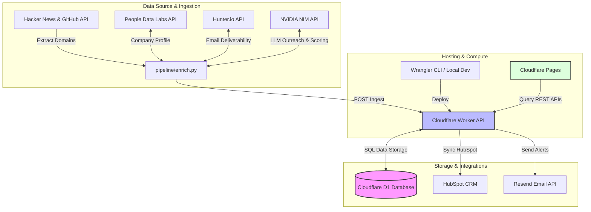

# 📊 AIRADAR — Global AI-First Startup Radar & Intelligence Engine

[](https://python.org)
[](https://workers.cloudflare.com)
[](https://build.nvidia.com)
[](https://typescriptlang.org)
[](LICENSE)

Live intelligence pipeline tracking global AI-first startups with ICP scoring, enrichment data, and GPT-generated outreach angles. Updates automatically via scheduled GitHub Actions workflows.

**Stack:** Cloudflare Workers + D1 Database + Pages · Python Enrichment Pipeline · NVIDIA NIM (`meta/llama-3.3-70b-instruct`)

---

## Architecture



---

## Deployment — Step by Step

### Prerequisites
- **Node.js** >= 18.0.0
- **Python** >= 3.8.0
- **Wrangler CLI** = 3.114.17
- **TypeScript** = 5.0.0
- Cloudflare account (free tier)
- GitHub account
- NVIDIA NIM API key (free tier at [build.nvidia.com](https://build.nvidia.com) — 1,000 free credits/month)
- Hunter.io API key (free tier, 50 requests/month)
- People Data Labs API key (free tier, 500 credits/month) — optional

---

### Step 1 — Install Wrangler CLI

```bash
npm install -g wrangler@3.114.17
wrangler login
```

---

### Step 2 — Create D1 Database

```bash
cd worker
wrangler d1 create airadar-db
```

Copy the `database_id` from the output and paste it into `wrangler.toml`.

Then create the schema:
```bash
wrangler d1 execute airadar-db --file=schema.sql
```

This creates the tables AND seeds 15 real AI-first startups for the demo.

---

### Step 3 — Set Worker Secrets

```bash
wrangler secret put NVIDIA_API_KEY
wrangler secret put HUNTER_API_KEY
wrangler secret put PDL_API_KEY        # optional but recommended
wrangler secret put PIPELINE_SECRET    # any random string, e.g. openssl rand -hex 32
```

---

### Step 4 — Deploy the Worker

```bash
cd worker
wrangler deploy
```

Note the Worker URL printed after deployment, e.g.:
`https://airadar.YOUR_ACCOUNT.workers.dev`

Test it with the following expected formats:
curl https://airadar.YOUR_ACCOUNT.workers.dev/api/health
# Expected Output: {"status":"ok","timestamp":"2026-06-16T12:00:00.000Z"}

curl https://airadar.YOUR_ACCOUNT.workers.dev/api/companies?limit=1
# Expected Output:
# {
#   "data": [
#     {
#       "id": 1,
#       "name": "Aisera",
#       "domain": "aisera.com",
#       "description": "Conversational AI and service management platform...",
#       "icp_score": 80,
#       "outreach_angle": "Congrats on your growth! Saw you use React and OpenAI...",
#       "enriched_at": "2026-06-16T12:00:00.000Z"
#     }
#   ],
#   "pagination": { "page": 1, "limit": 1, "total": 211, "pages": 211 }
# }
```

---

### Step 5 — Deploy the Frontend to Cloudflare Pages

1. Push this entire repo to GitHub
2. Go to Cloudflare Dashboard → Pages → Create a project
3. Connect your GitHub repo
4. Build settings:
   - Build command: (leave empty)
   - Build output directory: `frontend`
5. Deploy
6. **After deployment:** Update the `WORKER_BASE` URL in `frontend/index.html`:
   ```javascript
   const WORKER_BASE = 'https://airadar.YOUR_ACCOUNT.workers.dev';
   ```
   Commit and push — Cloudflare Pages auto-deploys.

---

### Step 6 — Set Up GitHub Actions Pipeline

1. In your GitHub repo → Settings → Secrets → Actions, add:
   - `NVIDIA_API_KEY`
   - `PDL_API_KEY`
   - `HUNTER_API_KEY`
   - `WORKER_URL` → your Cloudflare Worker URL
   - `PIPELINE_SECRET` → same secret you set on the Worker
2. The pipeline runs automatically every night at 2 AM UTC
3. Test a manual run: GitHub Actions tab → AIRADAR Pipeline → Run workflow

---

### Step 7 — Add Custom Domain (optional, free)

In Cloudflare Pages → your project → Custom domains:
- Add your domain (e.g. `airadar.clawoperator.in`)
- Cloudflare handles the SSL certificate automatically

---
## Local Development

**Worker:**
```bash
cd worker
npm install
wrangler dev --local
```

**Frontend:**
```bash
cd frontend
python3 -m http.server 3000
# Open http://localhost:3000
# Make sure WORKER_BASE = 'http://localhost:8787' in index.html
```

**Pipeline:**
```bash
cd pipeline
pip install httpx
export NVIDIA_API_KEY=nvapi-...
export WORKER_URL=http://localhost:8787
export PIPELINE_SECRET=your-secret
python enrich.py
```

---

## Testing

This project includes an automated end-to-end smoke and edge-case test suite.

To run tests locally:
```bash
# 1. Start wrangler locally (runs in background)
cd worker && npx wrangler dev --local

# 2. Execute the smoke test script
python tests/smoke_test.py
```

---

## Project Structure

```
airadar/
├── worker/
│   ├── index.ts          # Cloudflare Worker API
│   ├── schema.sql        # D1 schema + seed data (15 AI startups)
│   └── wrangler.toml     # Cloudflare config
├── frontend/
│   └── index.html        # Single-file dashboard (Cloudflare Pages)
├── pipeline/
│   └── enrich.py         # Python enrichment pipeline
├── tests/
│   └── smoke_test.py     # End-to-end smoke test script
└── .github/
    └── workflows/
        └── pipeline.yml  # GitHub Actions nightly trigger
```

---

## API Reference

| Endpoint | Description |
|---|---|
| `GET /api/companies` | List companies with filters |
| `GET /api/companies/:id` | Single company detail |
| `GET /api/companies/:id/score-breakdown` | Transparent scoring breakdown |
| `GET /api/stats` | Dashboard statistics |
| `GET /api/filters` | Dynamic filters (categories, stages, countries) |
| `GET /api/search?q=query` | Full-text search |
| `POST /api/companies/add` | Manually insert a company and enrich |
| `POST /api/score-custom` | Evaluates domain against custom ICP |
| `GET /api/user/profile` | Retrieve saved user profile |
| `POST /api/user/profile` | Update saved user profile |
| `GET /api/leads` | List saved company leads |
| `POST /api/leads` | Save/update a company lead |
| `POST /api/templates/download` | Record template download counts |
| `POST /api/alerts` | Configure Resend transactional alerts |
| `POST /api/pipeline/ingest` | Push enriched companies (requires auth) |
| `POST /api/pipeline/enrich/:id` | Score a single company with GPT |
| `POST /api/pipeline/rescore-all` | Recalculates transparent scoring |
| `POST /api/integrations/hubspot/sync` | Sync company records with HubSpot |
| `GET /api/health` | Health check |

---

## Contributing

We welcome contributions! Please check the guidelines in [CONTRIBUTING.md](file:///c:/projects/gtm-dashboard/CONTRIBUTING.md) to understand local development setups, PR checklists, and branch naming conventions.

---

## License

This project is licensed under the terms of the MIT License. See [LICENSE](file:///c:/projects/gtm-dashboard/LICENSE) for more details.
